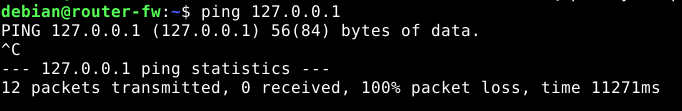
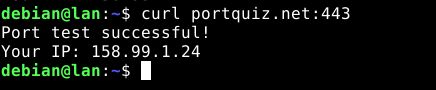
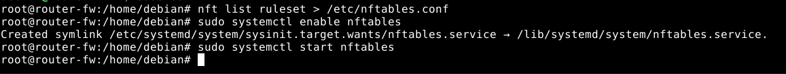
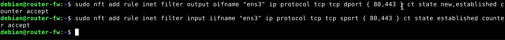
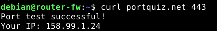
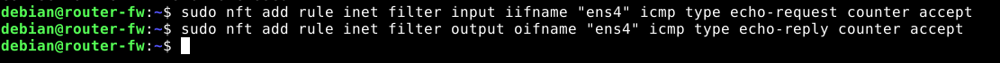

# Implementación de un cortafuegos perimetral con iptables

Vamos a realizar los primeros pasos para implementar un cortafuegos que protege la red interna.

## Esquema de red

Vamos a utilizar dos máquinas en openstack, que vamos a crear con la receta heat: escenario2.yaml. La receta heat ha deshabilitado el cortafuego que nos ofrece openstack (todos los puertos de todos los protocolos están abiertos). Una máquina (que tiene asignada una IP flotante) hará de cortafuegos, y la otra será una máquina de la red interna 192.168.100.0/24.

Puedes usar también las máquinas de tu escenario OpenStack (dulcinea y los clientes de la red interna).

## Preparación nftables

### Configuración de las rutas por defecto

En LAN:
```bash
sudo ip route del default
sudo ip route add default via 192.168.100.2
```

### Creación de las tablas filter y nat:
```bash
sudo nft add table inet filter
sudo nft add table inet nat
```

[Firewall2](capturas/1.png)

### Creación de las cadenas de filter:
```bash
sudo nft add chain inet filter input { type filter hook input priority 0 \; counter \; policy accept \; }
sudo nft add chain inet filter output { type filter hook output priority 0 \; counter \; policy accept \; }
sudo nft add chain inet filter forward { type filter hook forward priority 0 \; counter \; policy accept \; }
```

[Firewall2](capturas/2.png)

### Creación de las cadenas de nat:
```bash
sudo nft add chain inet nat prerouting { type nat hook prerouting priority 0 \; }
sudo nft add chain inet nat postrouting { type nat hook postrouting priority 100 \; }
```

[Firewall2](capturas/3.png)

### Tráfico ssh entrante al cortafuegos
```bash
sudo nft add rule inet filter input ip saddr 172.29.0.0/16 tcp dport 22 ct state new,established counter accept
sudo nft add rule inet filter output ip daddr 172.29.0.0/16 tcp sport 22 ct state established counter accept
```

[Firewall2](capturas/4.png)

### Políticas por defecto
```bash
sudo nft chain inet filter input { policy drop \; }
sudo nft chain inet filter output { policy drop \; }
sudo nft chain inet filter forward { policy drop \; }
```

[Firewall2](capturas/5.png)

No puedo hacer ping a localhost:
```bash
ping 127.0.0.1
```



No puedo hacer ping a Internet:
```bash
ping 8.8.8.8
```


Si no se nos corta la conexión ssh a la máquina después de este paso, el par de reglas que aplicamos antes funcionan.

### Activar el bit de forwarding
```bash
echo 1 > /proc/sys/net/ipv4/ip_forward
```


### SNAT
```bash
sudo nft add rule inet nat postrouting oifname "ens3" ip saddr 192.168.100.0/24 counter masquerade
```


### Tráfico ssh saliente cortafuegos -> LAN
```bash
sudo nft add rule inet filter output oifname "ens4" ip daddr 192.168.100.0/24 tcp dport 22 ct state new,established counter accept
sudo nft add rule inet filter input iifname "ens4" ip saddr 192.168.100.0/24 tcp sport 22 ct state established counter accept
```


Pruebo que funciona:
```bash
ssh debian@192.168.100.10
```


### Tráfico loopback
```bash
sudo nft add rule inet filter output oifname "lo" counter accept
sudo nft add rule inet filter input iifname "lo" counter accept
```


Ya funciona el ping a localhost:
```bash
ping 127.0.0.1
```


### Tráfico ICMP

### Permito ping entrante desde la red externa:
```bash
sudo nft add rule inet filter input iifname "ens3" icmp type echo-request counter accept
sudo nft add rule inet filter output oifname "ens3" icmp type echo-reply counter accept
```


Pruebo que funciona desde mi host:
```bash
ping 172.22.200.80
```


### Permito ping saliente cortafuegos -> LAN:
```bash
sudo nft add rule inet filter output oifname "ens4" icmp type echo-request counter accept
sudo nft add rule inet filter input iifname "ens4" icmp type echo-reply counter accept
```


Pruebo que funciona:
```bash
ping 192.168.100.10
```


### FORWARD: tráfico icmp saliente LAN -> Internet
```bash
sudo nft add rule inet filter forward iifname "ens4" oifname "ens3" ip saddr 192.168.100.0/24 icmp type echo-request counter accept
sudo nft add rule inet filter forward iifname "ens3" oifname "ens4" ip daddr 192.168.100.0/24 icmp type echo-reply counter accept
```


Pruebo que funciona el ping a Internet:
```bash
ping 8.8.8.8
```


### FORWARD: tráfico DNS saliente desde LAN
```bash
sudo nft add rule inet filter forward iifname "ens4" oifname "ens3" ip saddr 192.168.100.0/24 udp dport 53 ct state new,established counter accept
sudo nft add rule inet filter forward iifname "ens3" oifname "ens4" ip daddr 192.168.100.0/24 udp sport 53 ct state established counter accept
```


Pruebo que funciona:
```bash
dig @1.1.1.1 www.example.org
```


### FORWARD: tráfico http/https saliente desde LAN
```bash
sudo nft add rule inet filter forward iifname "ens4" oifname "ens3" ip protocol tcp ip saddr 192.168.100.0/24 tcp dport { 80,443 } ct state new,established counter accept
sudo nft add rule inet filter forward iifname "ens3" oifname "ens4" ip protocol tcp ip daddr 192.168.100.0/24 tcp sport { 80,443 } ct state established counter accept
```


Compruebo que funciona http:
```bash
curl portquiz.net:80
```


Compruebo que funciona https:
```bash
curl portquiz.net:443
```



### FORWARD: tráfico http entrante hacia LAN
```bash
sudo nft add rule inet filter forward iifname "ens3" oifname "ens4" ip daddr 192.168.100.0/24 tcp dport 80 ct state new,established counter accept
sudo nft add rule inet filter forward iifname "ens4" oifname "ens3" ip saddr 192.168.100.0/24 tcp sport 80 ct state established counter accept
```


### Necesito una regla DNAT:
```bash
sudo nft add rule inet nat prerouting iifname "ens3" tcp dport 80 counter dnat ip to 192.168.100.10
```


Compruebo que funciona desde mi host:
```bash
telnet 172.22.200.80 80
```


-


### Guardar la configuración del cortafuegos de forma persistente
```bash
nft list ruleset > /etc/nftables.conf
sudo systemctl enable nftables
sudo systemctl start nftables
```



## Debes añadir después las reglas necesarias para que se permitan las siguientes operaciones:

### a) Permite poder hacer conexiones ssh al exterior desde la máquina cortafuegos.
```bash
sudo nft add rule inet filter output oifname "ens3" tcp dport 22 ct state new,established counter accept
sudo nft add rule inet filter input iifname "ens3" tcp sport 22 ct state established counter accept
```


Pruebo que funciona conectando a mi host:
```bash
ssh ivan@172.29.0.26
```


### b) Permite hacer consultas DNS desde la máquina cortafuegos sólo al servidor 192.168.202.2. Comprueba que no puedes hacer un dig @1.1.1.1.
```bash
sudo nft add rule inet filter output ip daddr 192.168.202.2 udp dport 53 ct state new,established counter accept
sudo nft add rule inet filter input ip saddr 192.168.202.2 udp sport 53 ct state established counter accept
```


Pruebo que las consultas DNS a 192.168.202.2 funcionan:
```bash
dig @192.168.202.2 www.example.org
```


Pruebo que las consultas DNS a 1.1.1.1 no funcionan:
```bash
dig @1.1.1.1 www.example.org
```


### c) Permite que la máquina cortafuegos pueda navegar por internet.
```bash
sudo nft add rule inet filter output oifname "ens3" ip protocol tcp tcp dport { 80,443 } ct state new,established counter accept
sudo nft add rule inet filter input iifname "ens3" ip protocol tcp tcp sport { 80,443 } ct state established counter accept
```



Compruebo que funciona http:
```bash
curl portquiz.net 80
```


Compruebo que funciona https:
```bash
curl portquiz.net 443
```



### d) Los equipos de la red local deben poder tener conexión al exterior.

Este paso ya lo realicé en la preparación de la máquina. Necesitamos habilitar en el firewall dos cosas:

    SNAT
    Reglas forward para el tráfico ICMP saliente

Las reglas que definí para que funcionase fueron:
```bash
sudo nft add rule inet nat postrouting oifname "ens3" ip saddr 192.168.100.0/24 counter masquerade
sudo nft add rule inet filter forward iifname "ens4" oifname "ens3" ip saddr 192.168.100.0/24 icmp type echo-request counter accept
sudo nft add rule inet filter forward iifname "ens3" oifname "ens4" ip daddr 192.168.100.0/24 icmp type echo-reply counter accept
```

Pruebo que funciona:
```bash
ping 8.8.8.8
```


### e) Permitimos el ssh desde el cortafuego a la LAN.

Este paso ya lo realicé en la preparación de la máquina. Las reglas que definí para que funcionase fueron:
```bash
sudo nft add rule inet filter output oifname "ens4" ip daddr 192.168.100.0/24 tcp dport 22 ct state new,established counter accept
sudo nft add rule inet filter input iifname "ens4" ip saddr 192.168.100.0/24 tcp sport 22 ct state established counter accept
```

Pruebo que funciona conectando a mi host:
```bash
ssh ivan@172.29.0.26
```


### f) Permitimos hacer ping desde la LAN a la máquina cortafuegos.
```bash
sudo nft add rule inet filter input iifname "ens4" icmp type echo-request counter accept
sudo nft add rule inet filter output oifname "ens4" icmp type echo-reply counter accept
```



Pruebo que funciona:
```bash
ping 192.168.100.2
```


### g) Permite realizar conexiones ssh desde los equipos de la LAN.
```bash
sudo nft add rule inet filter forward iifname "ens4" oifname "ens3" ip saddr 192.168.100.0/24 tcp dport 22 ct state new,established counter accept
sudo nft add rule inet filter forward iifname "ens3" oifname "ens4" ip daddr 192.168.100.0/24 tcp sport 22 ct state established counter accept
```


Pruebo que funciona conectando a mi host para que atraviese el cortafuegos:
```bash
ssh ivan@172.29.0.26
```


### h) Instala un servidor de correos en la máquina de la LAN. Permite el acceso desde el exterior y desde el cortafuego al servidor de correos. Para probarlo puedes ejecutar un telnet al puerto 25 tcp.

Permitir acceso desde el exterior al servidor de correos de la LAN
```bash
sudo nft add rule inet filter forward iifname "ens3" oifname "ens4" ip daddr 192.168.100.0/24 tcp dport 25 counter accept
sudo nft add rule inet filter forward iifname "ens4" oifname "ens3" ip saddr 192.168.100.0/24 tcp sport 25 counter accept
sudo nft add rule inet nat prerouting iifname "ens3" tcp dport 25 counter dnat ip to 192.168.100.10
```


Pruebo que funciona desde mi host:
```bash
telnet 172.22.200.80 25
```


Permitir acceso desde el cortafuegos al servidor de correos de la LAN
```bash
sudo nft add rule inet filter output ip daddr 192.168.100.10 tcp dport 25 counter accept
sudo nft add rule inet filter input ip saddr 192.168.100.10 tcp sport 25 counter accept
```


Pruebo que funciona desde el cortafuegos:
```bash
telnet 192.168.100.10 25
```


### i) Permite poder hacer conexiones ssh desde exterior a la LAN.
```bash
sudo nft add rule inet filter forward iifname "ens3" oifname "ens4" ip daddr 192.168.100.0/24 tcp dport 22 ct state new,established counter accept
sudo nft add rule inet filter forward iifname "ens4" oifname "ens3" ip saddr 192.168.100.0/24 tcp sport 22 ct state established counter accept
sudo nft add rule inet nat prerouting iifname "ens3" tcp dport 22 counter dnat ip to 192.168.100.10
```


Pruebo que funciona desde mi host:
```bash
ssh debian@172.22.200.80
```


### j) Modifica la regla anterior, para que al acceder desde el exterior por ssh tengamos que conectar al puerto 2222, aunque el servidor ssh este configurado para acceder por el puerto 22.
```bash
sudo nft add rule inet nat prerouting iifname "ens3" tcp dport 2222 counter dnat ip to 192.168.100.10:22
```


Pruebo que funciona:
```bash
ssh -p 2222 debian@172.22.200.80
```


### k) Permite hacer consultas DNS desde la LAN sólo al servidor 192.168.202.2. Comprueba que no puedes hacer un dig @1.1.1.1.

Tenemos que ver que handle tiene la regla que permite hacer consultas DNS a cualquier servidor:
```bash
sudo nft list -a ruleset | grep 53
```


```
Deberemos eliminar antes las reglas que permiten hacer consultas DNS a cualquier servidor:
```bash
sudo nft delete rule inet filter forward handle 21 
sudo nft delete rule inet filter forward handle 22
```


Ahora podemos añadir las reglas que permiten hacer consultas DNS solo al servidor 192.168.202.2:
```bash
sudo nft add rule inet filter forward iifname "ens4" oifname "ens3" ip saddr 192.168.100.0/24 ip daddr 192.168.202.2 udp dport 53 ct state new,established counter accept
sudo nft add rule inet filter forward iifname "ens3" oifname "ens4" ip saddr 192.168.202.2 ip daddr 192.168.100.0/24 udp sport 53 ct state established counter accept
```


Pruebo que las consultas DNS a 192.168.202.2 funcionan:
```bash
dig @192.168.202.2 www.example.org
```


Pruebo que no puedo hacer consultas DNS a 1.1.1.1 (en la captura vemos como antes sí podíamos hacerlo, pero ahora tras eliminar las reglas que permitían hacer consultas DNS a cualquier servidor ya no podemos):
```bash
dig @1.1.1.1 www.example.org
```


### l) Permite que los equipos de la LAN puedan navegar por internet.

Este paso ya lo realicé en la preparación de la máquina. Las reglas que definí para que funcionase fueron:
```bash
sudo nft add rule inet filter forward iifname "ens4" oifname "ens3" ip protocol tcp ip saddr 192.168.100.0/24 tcp dport { 80,443 } ct state new,established counter accept
sudo nft add rule inet filter forward iifname "ens3" oifname "ens4" ip protocol tcp
```

Compuebo que funciona:
```bash
curl www.example.org
```


